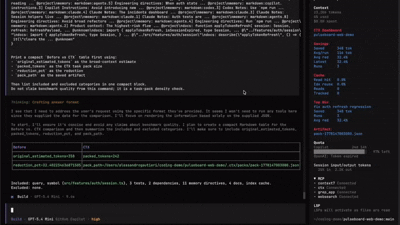

<div align="center">

<h1>CTX</h1>

<h3>The context layer for AI coding agents</h3>

<p><strong>Reduce token waste in OpenCode and AI coding workflows with graph memory, compact task packs, read-cache compression, command pruning, and a live right-sidebar dashboard.</strong></p>

<p>OpenCode-first runtime · Local MCP tools · Read cache + delta-aware indexing · Single Rust binary</p>

<p>
  
  
  
  
</p>

<p>
  <a href="#install-ctx">Install</a> ·
  <a href="#opencode-first-usage">OpenCode Usage</a> ·
  <a href="#ctx-dashboard">Dashboard</a> ·
  <a href="#proof-from-the-demo-fixture">Benchmarks</a> ·
  <a href="#documentation">Docs</a> ·
  <a href="#security">Security</a>
</p>

</div>

> CTX is a local context runtime for OpenCode and AI coding agents. It keeps repository knowledge, reusable rules, shell output, diffs, and file rereads compact before they ever bloat the model context.

## See It In Action

| Install + Bootstrap | Planning + Packing | Read Cache + Dashboard |
|---|---|---|
|  |  |  |
| Install `ctx`, run `ctx init`, `ctx index`, `ctx opencode install`, then open OpenCode. | Build a plan, pack the smallest useful context, and compare broad vs packed token cost. | Re-read files through `digest` mode and watch live savings in the right sidebar. |

## Contents

- [What CTX Is](#what-ctx-is)
- [Why It Exists](#why-it-exists)
- [Install CTX](#install-ctx)
- [OpenCode-First Usage](#opencode-first-usage)
- [What Works Today](#what-works-today)
- [Graph Memory](#graph-memory)
- [CTX Dashboard](#ctx-dashboard)
- [Proof From The Demo Fixture](#proof-from-the-demo-fixture)
- [Demo And Screenshots](#demo-and-screenshots)
- [Security](#security)
- [Documentation](#documentation)
- [Repository Layout](#repository-layout)

## What CTX Is

CTX is a local runtime layer for OpenCode. It indexes the repository, stores reusable guidance as graph memory, exposes local MCP tools, generates OpenCode slash commands, and keeps local telemetry about token savings, cache reuse, and compact context packs.

CTX is **not** another agent launcher.

- OpenCode keeps the selected model, provider, and normal workflow.
- CTX sits underneath as the context layer.
- The product surface is the OpenCode-native `/ctx-*` experience, not wrapper-first shell workflows.

## Why It Exists

Coding agents usually waste tokens on things that are useful once but expensive forever.

| Problem | Traditional flow | CTX flow |
|---|---|---|
| Project rules | Reload a full `AGENTS.md` every turn | Import rules into graph memory and retrieve only the relevant directives |
| File rereads | Pay full price for the same file again | Re-read unchanged files through `digest` / `outline` modes with local read-cache compression |
| Noisy logs | Paste thousands of repeated lines | Run `/ctx-run` or prune logs into root-cause signal |
| Broad diffs | Feed huge patches | Keep only task-relevant hunks and changed symbols |
| Repo navigation | Manual file spelunking | Query local graph, snippets, symbols, and semantic ranking |
| Host integration | Wrapper commands outside the agent | OpenCode-native `/ctx-*` commands plus local MCP tools |

## Install CTX

Install CTX with the channel that fits your workflow best:

- `cargo install ctx-cli`
- one-line installer script
- GitHub Release archives
- `npm i -g @alegau/ctx-bin`
- `brew tap Alegau03/ctx && brew install ctx`

Update paths:

- `ctx update`
- `ctx update --check`
- `cargo install ctx-cli --force`
- rerun the installer script
- `npm update -g @alegau/ctx-bin`
- `brew upgrade ctx`

### Cargo

```bash
cargo install ctx-cli
```

### One-Line Installer

```bash
curl -fsSL https://raw.githubusercontent.com/Alegau03/CTX/main/scripts/install.sh | sh
```

### npm

```bash
npm i -g @alegau/ctx-bin
```

### Homebrew

```bash
brew tap Alegau03/ctx
brew install ctx
```

### Source Install

```bash
git clone https://github.com/Alegau03/CTX.git
cd CTX
cargo install --locked --path crates/ctx-cli
```

Verify:

```bash
ctx help
ctx doctor
ctx update --check
```

Native update command:

```bash
ctx update
```

How `ctx update` behaves:

- installer-based installs: reruns the official installer path
- Cargo installs: prints `cargo install ctx-cli --force`
- npm installs: prints `npm update -g @alegau/ctx-bin`
- Homebrew installs: prints `brew upgrade ctx`
- ambiguous installs: prints all supported update commands without guessing

### GitHub Release Archive

Download the latest assets from [GitHub Releases](https://github.com/Alegau03/CTX/releases), then run:

```bash
shasum -a 256 -c SHA256SUMS
tar -xzf ctx-0.2.5-aarch64-apple-darwin.tar.gz
mkdir -p "$HOME/.local/bin"
install -m 0755 ctx-0.2.5-aarch64-apple-darwin/ctx "$HOME/.local/bin/ctx"
export PATH="$HOME/.local/bin:$PATH"
```

If you prefer a system-wide install:

```bash
sudo install -m 0755 ctx-0.2.5-aarch64-apple-darwin/ctx /usr/local/bin/ctx
```

For the full install matrix, release verification notes, native update behavior, and distribution details, see [docs/install.md](docs/install.md).

## OpenCode-First Usage

Once `ctx` is installed, enable it in any project:

```bash
cd /path/to/your/project
ctx init
ctx index
ctx opencode install
opencode
```

If you want the leanest possible OpenCode surface first:

```bash
ctx opencode install --profile core
```

Profile summary:

- `full` (default): full CTX slash-command surface plus the live right-sidebar `CTX Dashboard`
- `core`: lean daily workflow with `/ctx`, `/ctx-doctor`, `/ctx-plan`, `/ctx-retrieve`, `/ctx-pack`, `/ctx-run`, `/ctx-prune-logs`, `/ctx-stats`, and `/ctx-gain`

Inside OpenCode, start with:

```text
/ctx
```

From there, the main workflow is:

```text
/ctx-doctor
/ctx-memory-bootstrap
/ctx-plan <task>
/ctx-retrieve <query>
/ctx-read <file> [mode]
/ctx-pack <task>
/ctx-compare <task>
/ctx-run <shell command>
/ctx-gain
/ctx-dashboard
```

Toolbooks and reusable lessons are also first-class:

```text
/ctx-toolbook-import <name> <file>
/ctx-toolbook-search <name> "<query>"
/ctx-toolbook-pack <name> "<task>"
/ctx-learn <key> "<body>"
```

For full usage, expected outputs, and CLI equivalents, see [guide.md](guide.md) and [docs/commands.md](docs/commands.md).

## What Works Today

| Area | Current state |
|---|---|
| OpenCode integration | `ctx opencode install` writes `opencode.json`, `.opencode/commands/*.md`, `.opencode/instructions/ctx-host-first.md`, and in `full` profile also provisions `.opencode/tui.json` plus a live sidebar plugin |
| Install profiles | `ctx opencode install --profile full|core` lets you choose between the full CTX surface and a lean daily workflow |
| Command center | `/ctx` shows a categorized CTX menu and best next command |
| Planning | `/ctx-plan <task>` combines retrieval, graph, memory, and pack signals into an implementation plan |
| Context packing | `/ctx-pack <task>` builds compact task packs with graph, memory, failure, diff, and attachment signals |
| Density check | `/ctx-compare <task>` shows before-vs-CTX token density for one task |
| Read cache | `/ctx-read <file> [mode]` supports `full`, `outline`, and `digest` with session re-read compression |
| Delta-aware indexing | repeated `ctx index` runs reuse unchanged files and write index-cache summaries |
| Command compression | `/ctx-run <shell command>` keeps the root cause and stores the raw log |
| Gain reporting | `/ctx-gain` summarizes recent token savings and top repeated queries |
| Dashboard | the `full` profile adds a live right-sidebar `CTX Dashboard`, while `/ctx-dashboard` prints a local snapshot in-thread |
| Graph memory | bootstrap/import/search/list/get/set/delete/export project directives seeded from `AGENTS.md`, `CLAUDE.md`, `CODEX.md`, and Copilot instructions |
| Toolbooks | OpenCode-only `/ctx-toolbook-*` commands keep large CLI manuals out of `AGENTS.md` |
| Learning | `/ctx-learn <key> "<body>"` stores reusable project lessons in graph memory |
| Retrieval | hybrid graph, snippets, FTS, symbols, and semantic ranking with local fallback |
| Pruning | deterministic log and diff pruning with parser-aware diagnostics |
| MCP | local stdio MCP plus localhost HTTP JSON-RPC runtime |
| File coverage | Rust, Python, TypeScript, JavaScript, Markdown runbooks, and common config/script files |
| Privacy | local-only defaults, sensitive attachment blocking, local audit log |

## Graph Memory

Graph Memory is CTX's structured replacement for repeatedly loading whole instruction markdown files. It keeps directives local, queryable, editable, and exportable when markdown compatibility is still needed.

Instead of this:

- one giant `AGENTS.md`
- every host turn re-reading it
- unclear relevance to the active task

CTX lets you do this:

- import rules once with `/ctx-memory-bootstrap`
- retrieve only task-relevant directives with `/ctx-memory-search`
- fold those directives into `/ctx-plan` and `/ctx-pack`
- store new lessons with `/ctx-learn`

## CTX Dashboard

When CTX is installed with the default `full` profile, OpenCode gets a live `CTX Dashboard` in the right sidebar.

The sidebar is meant to be a lightweight control tower for the current repo, not another verbose chat response. It auto-refreshes local runtime metrics such as:

- total estimated tokens saved
- average tokens saved per run
- average and latest reduction percentages
- read-cache hit rate
- index-cache reuse rate
- top current win
- latest pack artifact

The right-sidebar view is intentionally compact. It focuses on the live metrics that matter most instead of repeating verbose activity logs or warning blocks that are already available in the main CTX outputs.

Use the `core` profile when you want the smallest possible slash-command surface and do not need the sidebar yet.

## Proof From The Demo Fixture

The committed demo benchmark compares a traditional markdown-rule flow against CTX graph memory on `demo/fixtures/opencode-auth-lab`.

| Metric | Result |
|---|---:|
| Markdown rule tokens | `744` |
| Graph memory tokens | `322` |
| Token reduction | `56.72%` |
| Query coverage | `markdown=1.00`, `graph=1.00` |
| Markdown answer success | `33.33%` |
| Graph memory answer success | `100.00%` |
| Quality wins | `markdown=0`, `graph=1`, `ties=0` |

Reproduce it with:

```bash
scripts/demo/opencode-auth-lab-benchmark.sh ./target/debug/ctx
```

Evidence files:

- [benchmark report](demo/fixtures/opencode-auth-lab/benchmarks/report.md)
- [benchmark JSON](demo/fixtures/opencode-auth-lab/benchmarks/report.json)
- [demo walkthrough](docs/demo-walkthrough.md)

External validation is also committed in [docs/external-benchmark-agentsmd.md](docs/external-benchmark-agentsmd.md), including a public-repo snapshot with:

- token reduction `72.62%`
- query coverage `markdown=1.00`, `graph=0.89`
- success rate `markdown=0.50`, `graph=1.00`
- quality wins `markdown=0`, `graph=1`, `ties=0`

## Demo And Screenshots

| Media Slot | Suggested Asset |
|---|---|
| Hero GIF | full install -> `ctx init` -> `ctx index` -> `ctx opencode install` -> `/ctx` |
| Sidebar GIF | live right-sidebar `CTX Dashboard` refreshing after `/ctx-pack` and `/ctx-read` |
| Command GIF | `/ctx-plan`, `/ctx-pack`, `/ctx-compare`, `/ctx-run` |
| Static Screenshot | `CTX Dashboard` in OpenCode right sidebar |

| Asset | Status |
|---|---|
| Fixture project | `demo/fixtures/opencode-auth-lab` is committed |
| Automated smoke | `scripts/demo/opencode-auth-lab-smoke.sh` |
| MCP smoke | `scripts/demo/opencode-auth-lab-mcp-smoke.sh` |
| Benchmark smoke | `scripts/demo/opencode-auth-lab-benchmark.sh` |
| Demo walkthrough | [docs/demo-walkthrough.md](docs/demo-walkthrough.md) |
| Recording script | [docs/demo-script.md](docs/demo-script.md) |
| Demo video | [Watch the OpenCode demo video](https://youtu.be/gFwGb7sCzKI) |

## Security

CTX is local-first by default:

- `local_only = true`
- `remote_upload_enabled = false`
- no mandatory network calls
- `.ctx/graph.db`, `.ctx/packs/`, `.ctx/stats/`, and `.ctx/audit.log` stay local
- sensitive-looking attachments such as `.env`, private keys, credentials, and secret files are blocked by default

See [docs/security.md](docs/security.md).

## Documentation

| File | Purpose |
|---|---|
| [guide.md](guide.md) | Operational OpenCode workflow, examples, expected outputs |
| [docs/commands.md](docs/commands.md) | Complete CTX command syntax and explanations |
| [docs/install.md](docs/install.md) | Install paths, PATH notes, release archive verification |
| [docs/opencode-integration.md](docs/opencode-integration.md) | OpenCode integration architecture and install profiles |
| [docs/demo-script.md](docs/demo-script.md) | Recording sequence for demos and walkthroughs |
| [docs/demo-walkthrough.md](docs/demo-walkthrough.md) | End-to-end fixture validation |
| [docs/architecture.md](docs/architecture.md) | Runtime architecture |
| [docs/security.md](docs/security.md) | Privacy and trust model |
| [docs/release-playbook.md](docs/release-playbook.md) | Release messaging and checklist |
| [docs/final-qa.md](docs/final-qa.md) | Final QA gate |
| [docs/external-benchmark-agentsmd.md](docs/external-benchmark-agentsmd.md) | Public external benchmark evidence |

## Repository Layout

| Path | Purpose |
|---|---|
| `crates/ctx-cli` | `ctx` binary, OpenCode bootstrap, user-facing CLI commands |
| `crates/ctx-core` | Runtime orchestration for indexing, packing, memory, retrieval, benchmarks |
| `crates/ctx-graph` | SQLite graph, FTS, memory directives, run metadata |
| `crates/ctx-mcp` | Local MCP runtime over stdio and localhost HTTP JSON-RPC |
| `crates/ctx-pack` | Budget-aware context packing and rewriting |
| `crates/ctx-prune` | Log and diff pruning |
| `crates/ctx-ast` | Symbol extraction and code slicing |
| `crates/ctx-semantic` | Semantic ranking and local fallback embedding backend |
| `crates/ctx-telemetry` | Local stats, audit lines, benchmark summaries |
| `demo/fixtures/opencode-auth-lab` | Realistic fixture project for smoke tests and benchmark proof |
| `scripts/demo` | Demo smoke, MCP smoke, and benchmark scripts |
| `scripts/install.sh` | Official user-local installer script |
| `scripts/release` | Build, package, verify, and final QA scripts |
| `packages/ctx-bin` | npm binary package that downloads prebuilt release assets |
| `Formula/ctx.rb` | Homebrew formula source used for local tap preparation |
