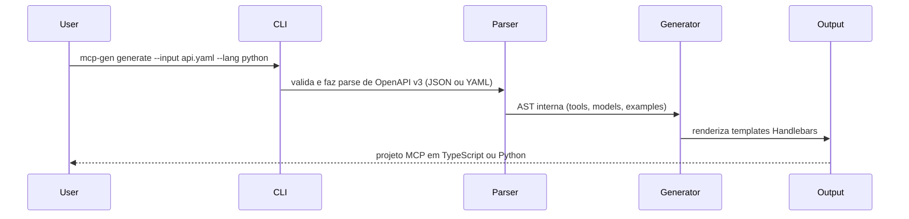

# MCP-Generator

> **Também disponível em:** [English (English Version)](README.md)

Gere servidores MCP a partir de specs OpenAPI.

> **Status**: 🚀 Versão `v2.0.0` Lançada! [Veja mudanças](https://github.com/ChristopherDond/MCP-Generator/releases/tag/v2.0.0)

`mcp-gen` transforma uma spec OpenAPI v3 em um servidor [Model Context Protocol](https://modelcontextprotocol.io) em TypeScript ou Python. Cada rota vira uma tool, e você pode regenerar sem perder o código customizado.


## Início rápido

```bash
npm install
npm run build
```

Gerar um servidor a partir de uma spec local:

```bash
mcp-gen generate -i examples/petstore.json -l typescript -o ./my-server
```

Validar uma spec sem gerar arquivos:

```bash
mcp-gen validate -i examples/petstore.yaml
```

Use a CLI interativa se preferir prompts:

```bash
npm run dev
```

## O que a ferramenta faz



Cada rota vira uma tool MCP com:

- entrada tipada a partir de parâmetros e request body
- respostas de exemplo da spec
- preservação opcional de código incremental

## Requisitos

- Node.js 20+
- npm 9+ ou yarn
- (Opcional) Python 3.8+ para projetos Python

Para instalar:

```bash
npm install -g mcp-gen
```

## Instalação

```bash
git clone https://github.com/ChristopherDond/MCP-Generator.git
cd MCP-Generator
npm install
npm run build
```

## CLI

### Comandos

- `mcp-gen generate` ou `mcp-gen g` cria um servidor a partir de uma spec.
- `mcp-gen validate` ou `mcp-gen v` confere uma spec sem gerar arquivos.
- `mcp-gen init` baixa uma spec pública conhecida e pode gerar um projeto.
- `mcp-gen watch` observa um arquivo ou URL e regenera quando houver mudança.

### Gerar

```bash
mcp-gen generate -i ./api/openapi.yaml -l typescript -o ./my-server
mcp-gen generate -i ./api/openapi.yaml -l python -o ./my-server
```

Flags úteis:

- `--force`, `-f` sobrescreve arquivos existentes.
- `--incremental` mantém o código entre `@@mcp-gen:start` e `@@mcp-gen:end`.
- `--name <name>` define o nome do servidor.
- `--server-version <version>` define a versão do servidor.
- `--plugin <path>` carrega um plugin.

### Validar

```bash
mcp-gen validate -i ./api/openapi.yaml
```

Formatos aceitos: `.json`, `.yaml`, `.yml` ou uma URL.

### Init

`init` usa o registry interno:

```bash
mcp-gen init --from list
mcp-gen init --from stripe
mcp-gen init --from stripe --generate -o ./stripe-mcp
```

Chaves disponíveis no registry:

| Chave | Descrição |
|-----|-------------|
| `stripe` | Stripe Payment API |
| `github` | GitHub REST API |
| `slack` | Slack Web API |
| `openai` | OpenAI API |
| `petstore` | Exemplo Swagger Petstore |
| `twilio` | Twilio Communications API |
| `shopify` | Shopify Admin API |
| `kubernetes` | Kubernetes API |
| `digitalocean` | DigitalOcean API |
| `azure` | Azure Resource Manager API |

### Watch

```bash
mcp-gen watch -i ./api/openapi.yaml -o ./my-server
mcp-gen watch -i https://example.com/spec.json --interval 60000
```

Para entradas via URL, `--interval <ms>` controla o polling. `--once` gera uma vez e encerra após a primeira mudança.

## Plugins

Plugins podem sobrescrever templates e registrar helpers extras do Handlebars.

Estrutura básica:

- `templates/typescript/...` ou `templates/python/...` para sobrescrever templates `.hbs`
- `index.js` que exporta `registerHandlebars(handlebars)` para helpers customizados

Exemplo:

```bash
mcp-gen generate -i ./api/openapi.yaml --plugin ./meu-plugin
mcp-gen watch -i ./api/openapi.yaml --plugin ./meu-plugin
```

Os templates do plugin substituem os do core quando usam o mesmo caminho em `templates/<lang>/`.

---

## Estrutura do projeto gerado

**TypeScript:**
```
my-server/
├── src/
│   ├── server.ts        # MCP server — definições de tools + handlers
│   └── models.ts        # Interfaces TypeScript geradas a partir dos schemas OpenAPI
├── .github/
│   └── workflows/
│       └── ci.yml
├── Dockerfile
├── package.json
├── tsconfig.json
└── README.md
```

**Python:**
```
my-server/
├── server.py            # Servidor FastMCP — definições de tools + handlers
├── models.py            # Modelos Pydantic gerados a partir dos schemas OpenAPI
├── requirements.txt
├── .github/
│   └── workflows/
│       └── ci.yml
├── Dockerfile
└── README.md
```

---

## Conectar ao Claude Desktop

**TypeScript:**
```json
{
  "mcpServers": {
    "my-server": {
      "command": "node",
      "args": ["/absolute/path/to/my-server/dist/server.js"]
    }
  }
}
```

**Python:**
```json
{
  "mcpServers": {
    "my-server": {
      "command": "python",
      "args": ["/absolute/path/to/my-server/server.py"]
    }
  }
}
```

Reinicie o Claude Desktop. As tools da sua API vão aparecer automaticamente.

---

## Implementar handlers

Os arquivos gerados retornam exemplos da spec por padrão. Substitua os stubs pela lógica real.

**TypeScript** (`src/server.ts`):
```typescript
case "get_users_id": {
  // @@mcp-gen:start:get_users_id
  const user = await db.users.findById(args.id);
  return { content: [{ type: "text", text: JSON.stringify(user) }] };
  // @@mcp-gen:end:get_users_id
}
```

**Python** (`server.py`):
```python
@mcp.tool()
async def get_users_id(id: float) -> Any:
    # @@mcp-gen:start:get_users_id
    user = await db.users.find_by_id(id)
    return user
    # @@mcp-gen:end:get_users_id
```

Código entre os marcadores `@@mcp-gen:start` e `@@mcp-gen:end` é preservado quando você roda `generate --incremental` novamente.

---

## Desenvolvimento

```bash
npm test
npx tsc --noEmit

# Exemplo TypeScript
node dist/cli/index.js generate --input examples/petstore.json --out /tmp/ts-test --force

# Exemplo Python
node dist/cli/index.js generate --input examples/petstore.yaml --lang python --out /tmp/py-test --force

# Exemplo incremental
node dist/cli/index.js generate --input examples/petstore.json --out /tmp/ts-test --incremental
```

---

## Roadmap

| Semana | Status | Escopo |
|------|--------|-------|
| 0–1 | ✅ Concluído | CLI, parser OpenAPI v3, gerador TypeScript, scaffold com 7 arquivos |
| 2 | ✅ Concluído | Entrada YAML, target Python/FastMCP, geração incremental |
| 3 | ✅ Concluído | Suporte a `oneOf`/`anyOf`, stubs de auth, testes de integração |
| 4 | ✅ Concluído | CLI interativa, publicação npm/pip |
| 5 | ✅ Concluído | `mcp-gen init --from stripe` — registry interno de specs |
| 6 | ✅ Concluído | Release candidate `v1.0.0-rc.1` — em teste, feedback bem-vindo! |
| 7+ | 📋 Planejado | Plugins customizados, melhorias a partir do feedback, versão final `v1.0.0` |

---

## Limitações conhecidas

- OpenAPI v2 (Swagger) não é suportado — apenas v3.x
- `oneOf` / `anyOf` / `discriminator` são parcialmente tratados
- O script `copy-templates` usa `cp` — no Windows, troque para `xcopy` no `package.json`

---

## Licença

MIT © 2026 - Christopher D.
