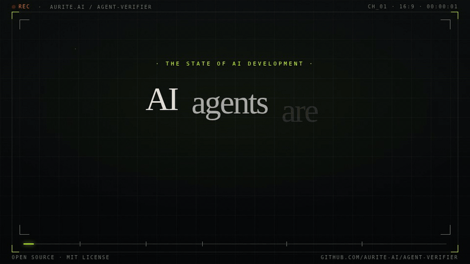

<div align="center">

# 🔍 Aurite Agent Verifier

**Catch security issues, enforce standards, and validate agent patterns — before code ships.**

[](https://github.com/aurite-ai/agent-verifier/stargazers)
[](LICENSE)
[](https://github.com/aurite-ai/agent-verifier/pulls)
[](https://github.com/aurite-ai/agent-verifier/commits)

Works with **Claude Code** · **Cursor** · **Windsurf** · **Roo Code** · **Codex** · [30+ more](https://github.com/vercel-labs/skills#supported-agents)



</div>

---

## Why?

AI coding agents are powerful — but they skip linting, ignore security basics, and hallucinate tool calls. Code reviews catch some of this, but not consistently.

Agent Verifier is an AI agent skill that acts as an automated reviewer. It checks for:
- 🔒 **Security gaps** — hardcoded secrets, missing input validation, exposed stack traces
- 🔄 **Dangerous agent patterns** — infinite loops, unbounded retries, hallucinated tools
- 📏 **Code quality** — naming, docs, error handling, magic values
- 🐍🟦🐹 **Language-specific issues** — Python type hints, TypeScript strict mode, Go error handling

Install it once. It runs every time you say `"verify agent"`.

---

## Author's Note

> 💡 **If Agent Verifier looks interesting to you — or saves you a prod bug — consider [giving it a ⭐](https://github.com/aurite-ai/agent-verifier/stargazers).** It's the only signal GitHub gives us that this is worth maintaining and adding more capabilities to this repo.

> 🤝 **Contributions and feature requests welcome** — open an [issue](https://github.com/aurite-ai/agent-verifier/issues) or [PR](https://github.com/aurite-ai/agent-verifier/pulls) any time.

## What You Get

Run `"verify agent"` in your coding assistant (eg. Claude Code, Cursor or others) and get a structured report:

```
✅ 8 checks passed | ⚠️ 3 warnings | ❌ 2 issues

❌ Hardcoded API key at config.py:12
  → Move to environment variable

❌ Hallucinated tool reference: execute_sql
  → Tool referenced in prompts but not defined

⚠️ Unbounded loop at agent/loop.py:45
  → Add MAX_ITERATIONS constant

⚠️ System prompt exceeds recommended size (6.2K tokens)
  → Split into modular sections
```

> All analysis runs locally. Your code never leaves your machine.

<details>
<summary>See full report format</summary>

```markdown
# Verification Report

**Project:** my-project
**Date:** 2026-03-04
**Mode:** Standalone
**Files analyzed:** 12
**Agent type detected:** LangGraph

## Summary

✅ 8 checks passed | ⚠️ 3 warnings | ❌ 2 issues

### By Category
| Category | Pass | Warn | Issue |
|----------|------|------|-------|
| Code Quality | 5 | 1 | 0 |
| Security | 2 | 0 | 1 |
| Agent Patterns | 1 | 2 | 1 |

## Agent Pattern Analysis

### Loop Safety
- [x] All retry mechanisms have explicit limits
- [ ] ⚠️ Potential unbounded loop at `agent/loop.py:45`

### Tool Consistency
- [x] Tool registry found: 5 tools defined
- [ ] ❌ 1 hallucinated tool reference in prompts

### Context Management
- [ ] ⚠️ System prompt exceeds recommended size (6.2K tokens)
- [x] Tool descriptions within limits

## Findings

### ✅ Passing
- Naming conventions: Consistent camelCase used throughout
- Error handling: All async functions have try/catch

### ⚠️ Warnings
- Missing type hints: `utils.py:45`
  - **Location:** `utils.py:45`
  - **Suggestion:** Add type hints to `process_data()` function

### ❌ Issues
- Hardcoded API key: `config.py:12`
  - **Location:** `config.py:12`
  - **Rule:** No secrets in source code
  - **Fix:** Move to environment variable

## Recommendations

1. Move API keys to environment variables
2. Add type hints to public functions

## Agent-Specific Recommendations

1. **Loop Safety:** Add `MAX_ITERATIONS` constant to `agent/loop.py`
2. **Tool Registry:** Remove or implement `execute_sql` tool
3. **Context Management:** Split system prompt into modular sections
```

</details>

---

## Quickstart

```bash
# Install (works with Claude Code, Roo Code, Cursor, and 30+ agents)
npx skills add aurite-ai/agent-verifier -a claude-code -a cursor -a <your-fav-coding-agent>

# Then in your agent folder just ask your coding assistant (eg. Claude Code, Cursor, or others):
verify agent
```

That's it. For more installation options, see [Installation](#installation).

### Learn More

New to Agent Verifier? These guides walk you through everything:

- **[Getting Started](docs/getting-started.md)** — Install and run your first verification in 5 minutes
- **[Tutorials](docs/tutorials/)** — Step-by-step guides:
  - [Installation](docs/tutorials/01-installation.md) — Detailed installation options
  - [First Verification](docs/tutorials/02-first-verification.md) — Run your first verification
  - [Understanding Reports](docs/tutorials/03-understanding-reports.md) — Interpret and prioritize findings
  - [Focused Checks](docs/tutorials/04-focused-checks.md) — Use individual verification skills

The rest of this README serves as a technical reference.

---

## Contributions

We welcome contributions of all kinds! Here's how you can help:

- 🐛 **Found a bug?** [Open an issue](https://github.com/aurite-ai/agent-verifier/issues)
- 💡 **Want a new check?** [Open a feature request](https://github.com/aurite-ai/agent-verifier/issues/new)
- 🔧 **Want to contribute code?** [Open a PR](https://github.com/aurite-ai/agent-verifier/pulls)

---

## Table of Contents

- [Why?](#why)
- [What You Get](#what-you-get)
- [Quickstart](#quickstart)
- [Architecture](#architecture)
- [Available Skills](#available-skills)
- [Installation](#installation)
- [Updating Installed Skills](#updating-installed-skills)
- [Usage](#usage)
- [Features](#features)
- [How It Compares](#how-it-compares)
- [Check Reliability](#check-reliability)
- [Privacy](#privacy)
- [Contributing](#contributing)
- [Citation](#citation)
- [License](#license)

---

## Architecture

```
┌─────────────────────────────────────────────────────────────┐
│                      verification                           │
│                 Full Suite Orchestrator                     │
│                 trigger: "verify agent"                     │
└───────────┬───────────┬───────────┬───────────┬─────────────┘
            │           │           │           │
            ▼           ▼           ▼           ▼
    ┌───────────┐ ┌───────────┐ ┌───────────┐ ┌───────────┐
    │  verify-  │ │  verify-  │ │  verify-  │ │  verify-  │
    │ security  │ │ patterns  │ │  quality  │ │ language  │
    ├───────────┤ ├───────────┤ ├───────────┤ ├───────────┤
    │ • secrets │ │ • loops   │ │ • naming  │ │ • Python  │
    │ • deps    │ │ • retries │ │ • docs    │ │ • TypeScript│
    │ • input   │ │ • tools   │ │ • errors  │ │ • Go      │
    │ • errors  │ │ • context │ │ • magic   │ │           │
    └───────────┘ └───────────┘ └───────────┘ └───────────┘

Each skill can run independently: "verify agent security", "verify agent patterns", etc.
```

## Available Skills

| Skill | Purpose |
|-------|---------|
| `verification` | Full verification suite (orchestrator) — runs all checks below |
| `verify-security` | Security checks (secrets, input validation, dependencies) |
| `verify-patterns` | Agent patterns (loops, retries, tools, context) |
| `verify-quality` | Code quality (naming, organization, docs) |
| `verify-language` | Language-specific checks (Python, TypeScript, Go) |

## Installation

### Recommended

```bash
# Install all skills to all detected agents (Claude Code, Roo Code, Cursor, etc.)
npx skills add aurite-ai/agent-verifier -a claude-code -a <your-fav-coding-agent>
```

<details>
<summary>More install options (specific agents, skills, or version)</summary>

```bash
# List available skills in this package
npx skills add aurite-ai/agent-verifier --list

# Install to specific agents (multi select allowed)
npx skills add aurite-ai/agent-verifier -a claude-code -a roo

# Install specific skills only
npx skills add aurite-ai/agent-verifier --skill verification verify-security

# Install globally (available in all projects)
npx skills add aurite-ai/agent-verifier -g
```

</details>

<details>
<summary>Install from GitHub repository</summary>

Install directly from a GitHub repo (public or private with access):

```bash
# List available skills
npx skills add github:aurite-ai/agent-verifier --list

# Install to specific agents (multi select allowed)
npx skills add github:aurite-ai/agent-verifier -a claude-code -a roo

# Install all skills from public GitHub repo
npx skills add github:aurite-ai/agent-verifier --all

# Install specific skills only
npx skills add github:aurite-ai/agent-verifier --skill verification verify-security

# From a specific branch
npx skills add github:aurite-ai/agent-verifier#main --all

# From a specific tag/release
npx skills add github:aurite-ai/agent-verifier#v1.0.0 --all

# From private repo (requires GitHub authentication)
npx skills add github:your-org/your-private-skill --all
```

</details>

<details>
<summary>Install from local source</summary>

Install from a local directory during development:

```bash
# List available skills in local repo
npx skills add ./path/to/agent-verifier --list

# Install to specific agents (multi select allowed)
npx skills add ./path/to/agent-verifier -a claude-code -a roo

# Install all skills from local path
npx skills add ./path/to/agent-verifier --all

# Install specific skills only
npx skills add ./path/to/agent-verifier --skill verification verify-patterns

# Install with link (for development - changes reflect immediately)
npx skills link .
```

</details>

<details>
<summary>Manual installation</summary>

For agents that don't support the skills CLI, copy the skill files directly:

```bash
# For Roo Code (copy all skills)
cp -r skills/* ~/.roo/skills/

# For Claude Code (copy all skills)
cp -r skills/* ~/.claude/skills/

# For other agents, check their documentation for the skills directory location
```

</details>

## Updating Installed Skills

### From NPM Registry

Re-run the install command to get the latest published version:

```bash
# Update all skills to latest version
npx skills add aurite-ai/agent-verifier --all
```

<details>
<summary>More update options</summary>

```bash
# Install to specific agents (multi select allowed)
npx skills add aurite-ai/agent-verifier -a claude-code

# Update specific skills only
npx skills add aurite-ai/agent-verifier --skill verification verify-security -a claude-code

# Or specify a version
npx skills add aurite-ai/agent-verifier@1.2.0 -a claude-code
```

</details>

<details>
<summary>Update from GitHub repository</summary>

Re-run with the same source to pull latest changes:

```bash
# Update all skills from default branch
npx skills add github:aurite-ai/agent-verifier --all -a claude-code

# Update from specific branch
npx skills add github:aurite-ai/agent-verifier#main --all -a claude-code

# Update to specific tag/release
npx skills add github:aurite-ai/agent-verifier#v1.2.0 -a claude-code
```

</details>

<details>
<summary>Update from local source or manual update</summary>

**Symlink install:** If installed with `npx skills link .`, changes reflect automatically. No action needed.

Check if you're using symlink:
```bash
# Check the skills-lock.json in your project
cat skills-lock.json  # Look for "method": "symlink"

# Or check the installed skill directly
ls -la .agents/skills/verification  # Should show -> pointing to source
```

**Copy install:** Re-run the install command to update:
```bash
# Reinstall from source
npx skills add /path/to/agent-verifier -a claude-code

# Or force reinstall
npx skills add /path/to/agent-verifier -a claude-code --force
```

**Remove and reinstall:**
```bash
# Remove each skill by skill name
npx skills remove verification

# Reinstall from any source
npx skills add aurite-ai/agent-verifier -a claude-code
```

**Manual update:**
```bash
# Copy updated files directly
cp -r /path/to/agent-verifier/skills/verification ~/.claude/skills/
```

</details>

## Usage

Once installed, trigger verification by asking your coding agent:

### Full Verification Suite

```
"verify agent"
```

This runs the complete verification suite covering security, agent patterns, code quality, and language-specific checks. Use this for comprehensive audits or pre-release reviews.

### Focused Verification

For faster, targeted checks, use domain-specific invocations:

| Command | What it checks |
|---------|----------------|
| `"verify agent security"` | Secrets, input validation, error exposure, dependency vulnerabilities |
| `"verify agent patterns"` | Loop safety, retry limits, tool registry, context size, LangGraph cycles |
| `"verify agent quality"` | Naming, organization, documentation, magic values, error handling |
| `"verify agent language"` | Python type hints, TypeScript strict mode, Go error handling |

### Legacy Triggers (Still Supported)

These phrases also trigger the full verification suite:
- "review this implementation"
- "check compliance"
- "audit my agent"
- "validate against best practices"

## Features

### Dual-Mode Operation

**Standalone Mode** (default):
- Automatically detects project language and framework
- Applies built-in best practices for code quality and security
- Honors existing lint configs (ESLint, Biome, etc.)

**Kahuna-Enhanced Mode** (when [Kahuna](https://github.com/aurite-ai/kahuna) is installed):
- Loads organization-specific rules from knowledge base
- Uses `kahuna_ask` for deeper context queries
- Applies framework patterns surfaced by `kahuna_prepare_context`

### Verification Checks

The skill performs comprehensive verification across multiple categories:

#### 1. Code Quality

| Check | Description | Severity |
|-------|-------------|----------|
| Naming conventions | Clear, descriptive, consistent naming | ⚠️ Warning |
| Code organization | Appropriate structure and modularity | ⚠️ Warning |
| Error handling | Proper try/catch, error propagation | ❌ Issue |
| Magic values | No unexplained numbers/strings | ⚠️ Warning |
| Documentation | Comments for complex logic | ⚠️ Warning |

#### 2. Security

| Check | Description | Severity |
|-------|-------------|----------|
| Hardcoded secrets | No API keys, passwords in source | ❌ Issue |
| Input validation | Validate external data | ❌ Issue |
| Error exposure | No stack traces in production | ⚠️ Warning |
| Secure defaults | Safe default configurations | ⚠️ Warning |
| Dependency vulnerabilities | Known CVEs in dependencies | ❌ Issue |

#### 3. Language-Specific

**Python:**
| Check | Description |
|-------|-------------|
| Type hints | Public functions should have type annotations |
| Docstrings | Modules, classes, functions should be documented |
| Requirements pinning | Dependencies should specify versions |

**TypeScript/JavaScript:**
| Check | Description |
|-------|-------------|
| Type safety | Prefer strict mode, avoid `any` |
| Async handling | Proper error handling for promises |
| Dependency security | No outdated/vulnerable packages |

**Go:**
| Check | Description |
|-------|-------------|
| Error handling | No ignored errors (`_ = err`) |
| Context propagation | Pass context through call chains |

#### 4. AI Agent Patterns

**Loop Safety:**
| Pattern | Language | Severity |
|---------|----------|----------|
| `while True:` without `break` | Python | ⚠️ Warning |
| `while (true)` without break | TS/JS | ⚠️ Warning |
| `for { }` without break/return | Go | ⚠️ Warning |
| Recursive calls without depth limit | All | ⚠️ Warning |

**Retry Limits:**
| Pattern | Required Parameter | Severity |
|---------|-------------------|----------|
| `@retry` (tenacity) | `stop=stop_after_attempt(n)` | ❌ Issue |
| `@backoff.on_exception` | `max_tries=n` | ❌ Issue |
| `retry` (async-retry) | `retries: n` | ❌ Issue |
| `p-retry` | `retries: n` | ❌ Issue |

**Tool Registry:**
| Check | Description | Severity |
|-------|-------------|----------|
| Hallucinated tools | Tool references not in registry | ❌ Issue |
| Undocumented tools | Tools not listed in prompts | ⚠️ Warning |

**Context Management:**
| Content Type | Warning | Issue |
|--------------|---------|-------|
| System prompt | > 4,000 tokens (~16KB) | > 8,000 tokens (~32KB) |
| Single tool description | > 500 tokens (~2KB) | > 1,000 tokens (~4KB) |
| Total tool descriptions | > 2,000 tokens (~8KB) | > 4,000 tokens (~16KB) |

> **Note:** "System prompt" refers to your agent's prompt files (e.g. `prompts/system.md`, `prompts.py`, `system.md`). Files in `skills/` directories are skill definitions loaded on demand, not static system prompts, and are excluded from this check.

#### 5. Framework Detection

Automatically detects and applies framework-specific checks:

| Framework | Detection | Special Checks |
|-----------|-----------|----------------|
| LangGraph | `langgraph` in imports | State schema, node connectivity |
| CrewAI | `crewai` in imports | Agent roles, task dependencies |
| AutoGen | `autogen` in imports | Agent configuration |
| LangChain | `langchain` in imports | Chain composition, memory config |
| Custom | Direct SDK usage | General agent patterns |

<details>
<summary>Testing the Skill</summary>

Test fixtures are provided in `tests/fixtures/` to validate the agent pattern detection:

```bash
# Navigate to a fixture directory and ask your agent to verify it
cd tests/fixtures/infinite_loop
# Then ask: "verify this code for agent patterns"

# Or verify all fixtures at once
cd tests/fixtures
# Then ask: "verify these test fixtures and report findings"
```

See [`tests/fixtures/README.md`](tests/fixtures/README.md) for expected results.

</details>

## How It Compares

| | Agent Verifier | ESLint/Biome | Semgrep | Manual Review |
|---|---|---|---|---|
| AI agent patterns (loops, retries, tools) | ✅ | ❌ | ❌ | Sometimes |
| Security checks | ✅ | Partial | ✅ | Sometimes |
| Language-specific quality | ✅ | ✅ | ✅ | ✅ |
| Works inside your AI agent | ✅ | ❌ | ❌ | ❌ |
| Zero config | ✅ | ❌ | ❌ | N/A |
| Context-size analysis | ✅ | ❌ | ❌ | Rarely |
| Runs locally / private | ✅ | ✅ | ✅ | ✅ |

Agent Verifier is not a replacement for linters — it catches what they cannot: agent-specific patterns, context management issues, and tool hallucinations.

## Check Reliability

Because Agent Verifier runs as an AI agent skill rather than a deterministic parser, checks are classified into two tiers. Every finding in the report is tagged accordingly.

| Tier | Tag | How it's applied | Reliability |
|------|-----|-----------------|-------------|
| Pattern-matched | `[P]` | Mechanical — rule applied exactly as specified to code structure | High — same answer on every run |
| Heuristic | `[H]` | Judgment — requires interpretation of intent or quality | Best-effort — may vary |

**Pattern-matched checks** (reliable):

| Check | What it looks for |
|-------|------------------|
| Retry limits | `@retry` / `@backoff` / `p-retry` / `urllib3.Retry` without explicit stop/total parameter → ❌ Issue |
| Loop safety | `while True` / `for {}` / `while (true)` without `break` in scope → ❌ Issue |
| Tool registry | Tool names referenced in prompts but absent from definitions → ❌ Issue |
| Context size | `len(prompt) / 4` compared against token thresholds → ⚠️ Warning / ❌ Issue |
| Requirements pinning | `>=`, `>`, or unpinned deps in `requirements.txt` / `pyproject.toml` → ❌ Issue |
| Hardcoded secrets | Assignments to `API_KEY`, `SECRET`, `PASSWORD`, `TOKEN` string literals → ❌ Issue |
| No `any` types (TS) | Unqualified `: any` annotations → ⚠️ Warning |
| Ignored errors (Go) | `_ = functionCall()` where function returns `error` → ❌ Issue |
| LangGraph cycles | Graph cycles with no reachable `END` in edge mappings → ❌ Issue |

**Heuristic checks** (best-effort):

| Check | Why it requires judgment |
|-------|-------------------------|
| Code organization | "Appropriate structure" is context-dependent |
| Naming conventions | Consistency requires understanding the project's conventions |
| Input validation | Whether validation is sufficient depends on the threat model |
| Docstring quality | Presence is checkable; usefulness is not |
| Tool error handling | What counts as adequate handling varies |

## Privacy

All code analysis happens locally. No telemetry, no external calls, no data collection. Your code never leaves your machine.

## Contributing

We welcome contributions of all kinds! Here's how you can help:

- 🐛 **Found a bug?** [Open an issue](https://github.com/aurite-ai/agent-verifier/issues)
- 💡 **Want a new check?** [Open a feature request](https://github.com/aurite-ai/agent-verifier/issues/new)
- 🔧 **Want to contribute code?** [Open a PR](https://github.com/aurite-ai/agent-verifier/pulls)


---

## Citation

If you use Agent Verifier in your research or reference it in a paper, please cite:

```bibtex
@misc{oswal2026agent,
  title={Agent Verifier: Catch security issues, enforce standards, and validate agent patterns — before code ships.},
  author={Oswal, Jiten},
  journal={Github (Open Source)},
  url={https://github.com/Aurite-ai/agent-verifier},
  year={2026}
}
```

---

## Built by Aurite AI

Built by [Aurite AI](https://aurite.ai). Interested in enterprise capabilities — secure agent infrastructure, shared context pools, administrative controls, and centralized hosting? Visit [aurite.ai](https://aurite.ai) or reach out at info@aurite.ai.

## License

MIT License — see [LICENSE](LICENSE)
