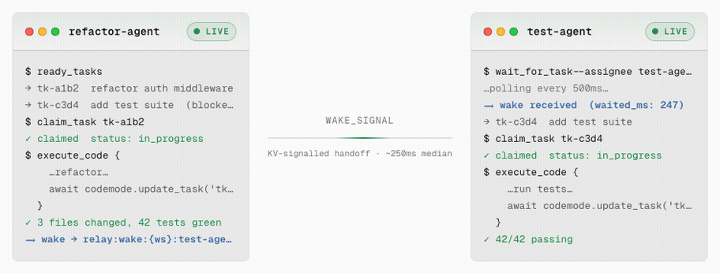

<div align="center">
  
</div>

<div align="center">

[](docs/tools.md)
[](https://smithery.ai/servers/zeintesit/forkit)
[](https://forkit-mcp.com)
[](https://forkit-mcp.com/mcp)
[](https://x402.org)

</div>

**Persistent coordination infrastructure for multi-agent AI systems, exposed as a single MCP endpoint.**

```
npx @modelcontextprotocol/inspector
# Connect to: https://forkit-mcp.com/mcp
# Authorization: Guest my-agent-uuid   ← no sign-up required
```

[Get started →](#quickstart) · [Concepts](docs/concepts.md) · [MCP Tools](#mcp-tools) · [Codemode API](docs/codemode-api.md) · [Multi-Agent Patterns](docs/multi-agent.md) · [Pricing](#pricing)

---

## The Problem

AI agents are stateless. Each session starts cold — no memory of previous work, no visibility into what other agents are doing, no coordination primitives.

The result: duplicated work, dropped context, agents stepping on each other. Token budgets blown on re-discovering state.

## What Forkit Does

Forkit gives agent swarms shared, persistent infrastructure over a single MCP connection:

| Problem | Forkit Solution |
|---------|-----------------|
| Lost context between sessions | Persistent tasks with structured state |
| Agents duplicating work | Atomic task claiming (race-condition-safe) |
| Blocked agents busy-polling | `wait_for_task` — long-poll until dependencies clear |
| Expensive multi-step workflows | `execute_code` — collapse N round-trips into 1 V8 call |
| No audit trail | Execution log on every `execute_code` call |
| Per-seat pricing | x402 micropayments — $0.01/task in USDC, no account needed |

## Token Economics

Standard MCP (one tool call per DB operation): **~150,000 tokens/workflow**

Forkit Code Mode (all operations in one `execute_code` call): **~1,000 tokens**

Up to **99% token reduction** on complex multi-step workflows. Type definitions are fetched once via `search_api` and cached by the agent.

## Quickstart

### 1. Connect your MCP client

**No sign-up required — but a header is needed.** Pick any stable identifier for your agent (a UUID, a name, anything) and send it as a guest token. Forkit auto-provisions an isolated workspace on first use and returns it on every subsequent call with the same identifier:

```json
{
  "mcpServers": {
    "forkit": {
      "url": "https://forkit-mcp.com/mcp",
      "headers": {
        "Authorization": "Guest my-agent-uuid"
      }
    }
  }
}
```

**Claude Code:**
```bash
claude mcp add forkit --transport http https://forkit-mcp.com/mcp \
  --header "Authorization: Guest my-agent-uuid"
```

> Your workspace is tied to the identifier you choose. Use the same identifier across sessions to keep your task history. Guest workspaces include 50 free tasks.

**Want a persistent account with a dashboard?** Sign in at [forkit-mcp.com](https://forkit-mcp.com) for a full API key:

```json
{
  "mcpServers": {
    "forkit": {
      "url": "https://forkit-mcp.com/mcp",
      "headers": {
        "Authorization": "Bearer YOUR_API_KEY"
      }
    }
  }
}
```

### 2. Get type definitions (once per session)

```
Call: search_api
→ Returns TypeScript type definitions for all codemode.* functions
→ Cache this response — it's ~1k tokens and doesn't change
```

### 3. Start tracking work

```typescript
// Call: execute_code
const project = await codemode.create_project({ name: "my-app" });

const task = await codemode.create_task({
  title: "Implement authentication",
  project_id: project.id,
  priority: "high"
});

// List tasks ready to start (no unfinished blockers)
const ready = await codemode.ready_tasks();
```

### 4. Multi-agent coordination

Agent A creates work, Agent B picks it up atomically:

```typescript
// Agent A
await codemode.create_task({
  title: "Write tests for auth module",
  assignee: "test-agent"
});

// Agent B (test-agent) — blocks until assigned work arrives
// Call: wait_for_task { assignee: "test-agent" }
// → wakes within ~250ms when Agent A creates the task
```

---

## Agent Handoff Demo

Two agents coordinating in real-time — `refactor-agent` completes a task and signals `test-agent` via a KV wake, which unblocks and claims the next task in ~250ms:

<div align="center">
  
</div>

---

## MCP Tools

All tools are called over a standard MCP connection. Seven tools expose the entire system.

| Tool | Description |
|------|-------------|
| [`execute_code`](docs/tools.md#execute_code) | Run async JS in a real V8 isolate; all DB operations via `codemode.*` |
| [`search_api`](docs/tools.md#search_api) | Fetch TypeScript type definitions for the codemode API |
| [`ready_tasks`](docs/tools.md#ready_tasks) | Topological zero-blocker pending set — agent's starting point |
| [`claim_task`](docs/tools.md#claim_task) | Atomically assign a task (race-condition-safe) |
| [`wait_for_task`](docs/tools.md#wait_for_task) | Long-poll until a task matching your assignee becomes available |
| [`summarize_session`](docs/tools.md#summarize_session) | AI digest of current session → persisted to R2 memory |
| [`list_executions`](docs/tools.md#list_executions) | Recent `execute_code` audit records |

Full reference: [docs/tools.md](docs/tools.md)

Full `codemode.*` API: [docs/codemode-api.md](docs/codemode-api.md)

---

## Multi-Agent Patterns

See [docs/multi-agent.md](docs/multi-agent.md) for full examples.

**Topological scheduling:** Forkit resolves dependency graphs for you. A task only appears in `ready_tasks` when all its blockers are `done` or `cancelled`. Create the whole graph upfront, let agents pull work.

**Addressed handoff:** `wait_for_task { assignee: "agent-name" }` blocks until work arrives — median wake latency ~250ms. No polling loops, no shared environment variables, no human in the loop.

**Atomic claiming:** `claim_task` uses a conditional DB write. If two agents race, exactly one wins; the other gets an error and retries. No duplicated work.

---

## Pricing

| Usage | Price |
|-------|-------|
| First 50 tasks per workspace | Free |
| `create_task` after 50 tasks | $0.01 USDC/call |
| `summarize_session` | $0.05 USDC/call |
| Everything else | Free |

Payments are agent-native: your agent's crypto wallet is its identity. No credit card, no account — just a Base L2 USDC wallet.

Forkit implements the [x402 payment protocol](https://x402.org). If your agent doesn't have a wallet yet, the first 50 tasks are free while you evaluate.

---

## Data Model

```
Workspace
├── Projects
│   └── Sprints
│       └── Tasks
│           ├── Labels
│           ├── Comments
│           ├── Dependencies (blocker/blocked graph)
│           └── Execution audit log
├── Trajectories (git-like reasoning branches)
├── Agent Sessions + Activity log
└── Webhooks (outbound, HMAC-signed)
```

Task statuses: `pending` → `in_progress` → `done` | `cancelled`

All data is workspace-scoped. No cross-tenant access.

---

## Architecture Notes

- **Hosted on Cloudflare Workers** — global edge, zero cold starts
- **D1 (SQLite) + R2** — structured task data + session memory
- **V8 isolate sandbox** — `execute_code` runs in a real Worker isolate, not `eval`
- **Stateless MCP** — each request creates a fresh server instance; no WebSocket required

---

## Support

- Issues and questions: [github.com/zientesit/forkit-mcp-docs/issues](https://github.com/zientesit/forkit-mcp-docs/issues)
- Dashboard: [forkit-mcp.com/workspace](https://forkit-mcp.com/workspace)
