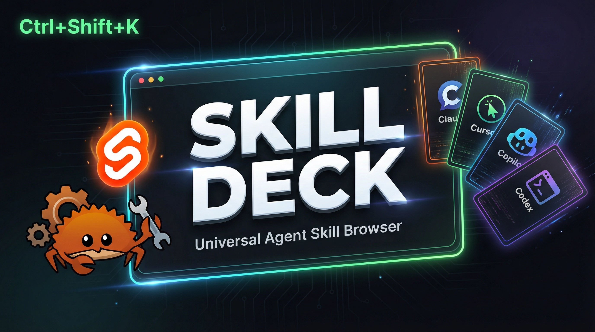

<div align="center">



### the universal skill browser for AI coding agents

<p>One overlay. Every coding agent on your machine. Searchable in milliseconds.</p>

<p>
  
  
  
  
  
  
</p>

</div>

---

## the pain

Every coding agent invents its own skill format. Claude Code drops SKILL.md. Cursor has .mdc. Copilot has prompt files. Codex, Windsurf, Gemini, Cline, Roo, Continue, Aider, Amazon Q, JetBrains, Tabnine, Augment — each one with a different layout, a different folder, a different rendering convention.

You install fifty skills across six agents and lose track of what you have, what you actually use, and which ones are stale. You hunt through dotfiles to remember a slash command. You re-read a SKILL.md you wrote three months ago because no UI lets you skim them all.

## what skill deck does

Press `Ctrl+Shift+K`. A panel slides in. Every skill, command, hook, rule, prompt, and workflow you have across every coding agent, in one searchable list. Click one, see the body. Star the good ones. Snapshot before you let the agent overwrite them.

No editor-switching. No dotfile spelunking. One overlay, everything visible, instant.

## quickstart in 30 seconds

```bash
git clone https://github.com/OthmanAdi/skill-deck
cd skill-deck
pnpm install && pnpm tauri dev
```

Press `Ctrl+Shift+K` anywhere on your desktop. The overlay opens. Type. Skills filter live.

For a production binary instead of dev mode:

```bash
pnpm tauri build
```

Or grab a prebuilt installer from the [latest release](https://github.com/OthmanAdi/skill-deck/releases/latest).

## who supports what

Skill Deck reads from every agent below through one adapter pipeline. The frontend never sees agent-specific formats — everything normalizes to a single Skill struct.

| Agent | Artifacts read |
|---|---|
| Claude Code | SKILL.md, slash commands, settings hooks, agents, plugins |
| Codex | SKILL.md, AGENTS.md |
| Cursor | SKILL.md, .mdc rules, .cursorrules |
| GitHub Copilot | .prompt.md, .instructions.md, copilot-instructions.md |
| Windsurf | SKILL.md, .windsurf/rules, .windsurfrules |
| Gemini CLI | SKILL.md, GEMINI.md |
| Cline, Roo Code, Continue | SKILL.md, rules dirs, .clinerules / .roorules |
| Aider, Amazon Q, JetBrains AI, Tabnine, Augment | per-agent skill + rule files |
| OpenCode, Crush, Amp, Antigravity, Goose, Kilo, Qwen, Kimi, Droid, Warp, Zencoder, +35 more | SKILL.md under each agent's store and the shared `~/.agents/skills` |
| Universal | AGENTS.md |

**56 coding agents** plus the universal `AGENTS.md` format, all wired in `registry.rs`. Adding the next one is a single struct entry. See [Adding a New Agent](#adding-a-new-agent).

## features

| | What it does |
|---|---|
| **Universal scan** | One pass across all 50+ agents, normalized into a single skill list. |
| **Live search + facets** | Filter by name, description, tag, intent, language, slash command, hook event. |
| **On-demand finder** | `Ctrl+F` opens a focused filter panel. State persists per session. |
| **Tree + grouped views** | Card hierarchies for nested skills, grouped lists by agent with brand colors. |
| **Marketplace registry** | First-party integration with [skills.sh](https://skills.sh) and [ClawHub](https://clawhub.ai) — search public skills, copy the `npx skills add` command, install in one shell. |
| **Update detection** | Auto-discovers the GitHub source for each skill and checks for upstream commits behind the GitHub API. |
| **Snapshot + restore** | Every update writes a content-hashed snapshot. Diff against the prior version side-by-side. Restore in one click. |
| **Starred + history pills** | Pin the skills you actually use. See installed-since / updated-since timestamps on every card. |
| **Themes** | System / Dark / Light, all with proper contrast. |
| **Hotkey + tray + auto-hide** | Global hotkey rebindable from a press-to-capture field (click, press your keys, auto-saves on the main key — supports modifiers + letters / digits / F1-F24 / arrows / Space / Esc / common punctuation). System tray with mode toggles. Auto-hide on focus loss. |
| **Tooltips that always show** | Badges and chips portal to `document.body` so the overlay's `overflow: hidden` chrome can no longer clip them. |

## under the hood

```
src-tauri/src/
├── agents/registry.rs     # the only file you edit to add an agent
├── agents/scanner.rs      # filesystem glob → adapter dispatch → Vec<Skill>
├── parsers/               # frontmatter + skill_md + claude_hooks
├── models/skill.rs        # universal Skill struct, the single source of truth
├── detection/             # repo detection, update checker, snapshot history
│   └── marketplaces/      # skills.sh + clawhub providers
└── commands/              # Tauri IPC surface (scan, star, snapshot, restore, etc.)

src/lib/
├── components/            # Svelte 5 overlay UI
├── stores/                # runes-based state (no writable/derived stores)
└── types/                 # TypeScript mirrors of Rust models
```

**Key rule.** The Svelte frontend never sees agent-specific shapes. Every adapter normalizes to `models/skill.rs`. Adding an agent is one struct edit; everything else cascades automatically.

Detailed discovery + parser notes: [`docs/skill-discovery.md`](docs/skill-discovery.md).

## adding a new agent

1. Add a variant to the `AgentId` enum in `src-tauri/src/models/skill.rs`.
2. Add one entry to `src-tauri/src/agents/registry.rs` with `display_name`, `paths` (using `$HOME` / `$PROJECT`), `format`, `brand_color`.
3. If the format is novel, add a parser in `src-tauri/src/parsers/`. Otherwise `frontmatter.rs` handles it.

The scanner picks it up automatically. No other code changes needed.

## install paths

Prebuilt binaries via GitHub Releases:

- **Windows x64** — NSIS installer (`.exe`), MSI, or raw executable
- **macOS** — ARM64 and x64 platform bundles
- **Linux x64** — AppImage / deb / rpm

Latest release: [`/releases/latest`](https://github.com/OthmanAdi/skill-deck/releases/latest)

Build from source:

```bash
pnpm install
pnpm tauri build
# binaries under src-tauri/target/release/
```

## signing and updates

The prebuilt installers are not yet code-signed, so the first launch shows a warning:

- **Windows**: SmartScreen says "Windows protected your PC". Click **More info**, then **Run anyway**.
- **macOS**: Gatekeeper may say the app cannot be opened. Right-click the app and choose **Open**, or run `xattr -dr com.apple.quarantine "/Applications/Skill Deck.app"`.

There is no in-app auto-updater yet. The "Update detection" feature checks your installed *skills* against their GitHub sources; it does not update the app itself. To move to a newer Skill Deck, grab the latest installer from [Releases](https://github.com/OthmanAdi/skill-deck/releases/latest).

## platform support

| Capability | Windows | macOS | Linux |
|---|---|---|---|
| Overlay + scan + search + Card View + facets | ✓ | ✓ | ✓ |
| Global hotkey + tray | ✓ | ✓ | ✓ |
| Marketplace registry (skills.sh + ClawHub) | ✓ | ✓ | ✓ |
| Snapshot + diff + restore | ✓ | ✓ | ✓ |
| Update detection (GitHub API) | ✓ | ✓ | ✓ |

## tech stack

| Layer | Technology |
|---|---|
| Desktop shell | [Tauri v2](https://tauri.app) |
| Backend | Rust 1.90, tokio, serde, [gray_matter](https://crates.io/crates/gray_matter), reqwest |
| Frontend | [Svelte 5](https://svelte.dev) (runes), SvelteKit 2, Tailwind CSS v4, TypeScript |
| Marketplace clients | reqwest against [skills.sh](https://skills.sh) + [ClawHub](https://clawhub.ai) public APIs |
| Syntax highlight | [highlight.js](https://highlightjs.org) |

## built on the shoulders of

- [Tauri](https://github.com/tauri-apps/tauri) — the desktop runtime that makes Rust + Svelte ship as one binary
- [Svelte 5](https://github.com/sveltejs/svelte) — runes-based reactive UI that compiles to almost nothing
- [skills.sh](https://skills.sh) + [ClawHub](https://clawhub.ai) — the public skill marketplaces this app reads
- [highlight.js](https://github.com/highlightjs/highlight.js) — the syntax highlighter used in skill body preview + diff view
- [gray_matter](https://github.com/the-alchemists-of-arland/gray-matter-rs) — the YAML + markdown frontmatter parser at the heart of the universal adapter

## project setup for AI agents working on this repo

This repo is instrumented for multi-agent development. Each agent gets its own briefing file at the root:

| File | Read by |
|---|---|
| `CLAUDE.md` | Claude Code |
| `AGENTS.md` | Codex, Copilot, all universal-AGENTS.md aware tools |
| `GEMINI.md` | Gemini CLI |
| `.cursorrules` | Cursor |
| `.windsurfrules` | Windsurf |
| `.github/copilot-instructions.md` | GitHub Copilot |

## contributing

Read [`CONTRIBUTING.md`](CONTRIBUTING.md) and [`SECURITY.md`](SECURITY.md) before opening a pull request.

```bash
cd src-tauri && cargo test
cargo clippy -- -D warnings
pnpm check
```

Pull requests welcome — particularly new adapters in `registry.rs`, new parsers in `parsers/`, and new marketplace providers in `detection/marketplaces/`.

## license

MIT — [Ahmad Adi](https://github.com/OthmanAdi).
